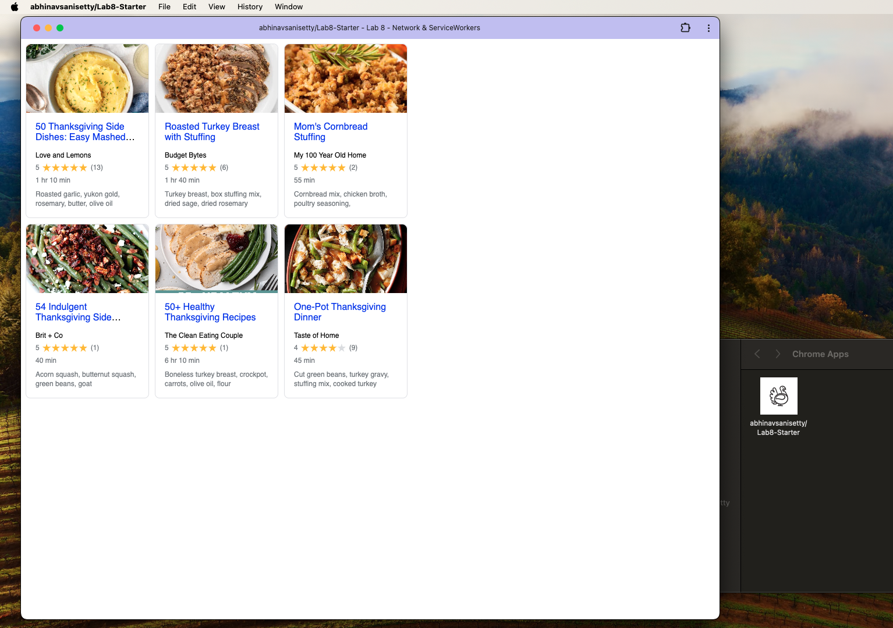

# Lab8-Starter

- I completed this Lab on my own
- https://github.com/abhinavsanisetty/Lab8-Starter
- Graceful degradation focuses on ensuring that applications function across a range of different devices that have different computational capabilities, network conditions, and differ in other features as well. Service workers allow you to make web applications that perform better without proper network connectivity and provide offline functionality. This helps in the process of graceful degradation since now applications can function on devices that dont have very good network connectivity, making the application more accessible and work on a wider range of devices. Service workers are essentially a tool used to implement graceful degradation. 

